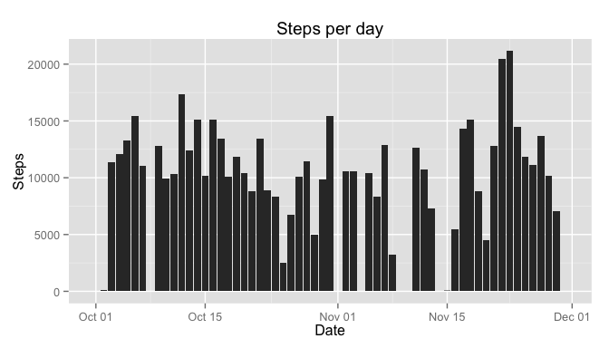
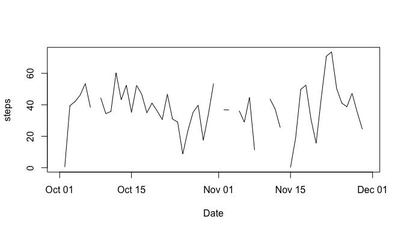
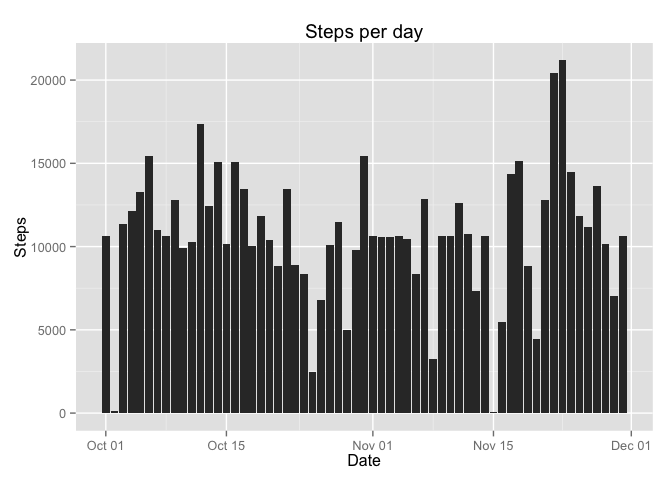
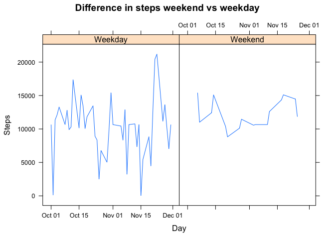

# Reproducible Research: Peer Assessment 1


## Loading and preprocessing the data

```r
library("ggplot2")
library("dplyr")
```

```
## 
## Attaching package: 'dplyr'
## 
## The following objects are masked from 'package:stats':
## 
##     filter, lag
## 
## The following objects are masked from 'package:base':
## 
##     intersect, setdiff, setequal, union
```

```r
library("stringr")
library(lattice) 

activity <- read.table("activity.csv", header=TRUE, sep=",", na.strings=c("NA", ""))
# Make a date formatted date
activity$dates <- as.Date(as.character(activity$date,"%Y-%m-%d"))

activity$time <- str_pad(str_pad(activity$interval, width=4, side="left", pad="0"), width=6, side="right", pad="0")

activity$datetimestr <- paste(activity$date, activity$time, sep=" ")

activity$datetime <- as.POSIXct(strptime(activity$datetimestr, "%Y-%m-%d %H%M%S"))

steps_per_day <- aggregate(activity$steps, by=list(date=activity$dates), FUN=sum, na.rm=TRUE)


# Total steps 
total_steps <- sum(activity$steps, na.rm=TRUE)
day_group <- group_by(activity, dates)
summary <- summarise(day_group, count=n())
days <- length(unique(activity$date))


mean_steps <- round(total_steps / days)
```

# Plot steps per day

```r
qplot(steps_per_day$date, steps_per_day$x, na.rm =TRUE, geom="histogram", stat="identity") + xlab("Date") + ylab("Steps") + ggtitle("Steps per day")
```

 


## What is mean total number of steps taken per day?

The mean total of steps taken per day is: 9354


## What is the average daily activity pattern?

```r
mean_steps_per_day <- aggregate(activity$steps, by=list(date=activity$dates), FUN=mean,  na.actions=na.omit)
plot(mean_steps_per_day$x ~ steps_per_day$date, type="l", xlab="Date", ylab="steps")
```

 

```r
highest_avg_interval <- aggregate(activity$steps, by=list(interval=activity$interval), FUN=mean,  na.rm=TRUE)

highest_avg_interval$Max <- highest_avg_interval$x == max(highest_avg_interval$x)

interval_with_max_steps_average <- highest_avg_interval$interval[highest_avg_interval$Max == TRUE]
```

The interval with the highest average steps is 835


## Imputing missing values

```r
#calculate the mean steps per interval
mean_steps <- round(mean(activity$steps, na.rm=TRUE))

# make a new data table
impute_table <- activity

# update the nas in the datatable to the mean_steps
impute_table[is.na(impute_table)] <- mean_steps

#populate missing values
missing_values <- sum(is.na(activity$steps))

imputed_steps_per_day <- aggregate(impute_table$steps, by=list(date=impute_table$dates), FUN=sum, na.rm=TRUE)
```

Missing Data Values: 2304


```r
qplot(imputed_steps_per_day$date, imputed_steps_per_day$x, na.rm =TRUE, geom="histogram", stat="identity") + xlab("Date") + ylab("Steps") + ggtitle("Steps per day")
```

 

Mean steps per day (imputed): 1.0752\times 10^{4}  
Mean steps per day (original): 9354  

Median steps per day (imputed): 1.0656\times 10^{4}  
Median steps per day (original): 1.0395\times 10^{4}  

## Are there differences in activity patterns between weekdays and weekends


```r
#workout the day of the week
imputed_steps_per_day$weekday <- weekdays(imputed_steps_per_day$date)
#add boolean for weekend/weekday
imputed_steps_per_day$Weekend <- imputed_steps_per_day$weekday %in% c("Saturday", "Sunday")

#Make a decorative factor variable
imputed_steps_per_day$day_type[imputed_steps_per_day$Weekend==TRUE] <- "Weekend"
imputed_steps_per_day$day_type[imputed_steps_per_day$Weekend==FALSE] <- "Weekday"


xyplot(x  ~ date | day_type, data=imputed_steps_per_day, type="l", xlab="Day", ylab="Steps", main="Difference in steps weekend vs weekday")
```

 

